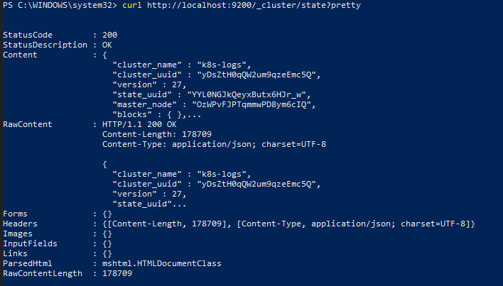
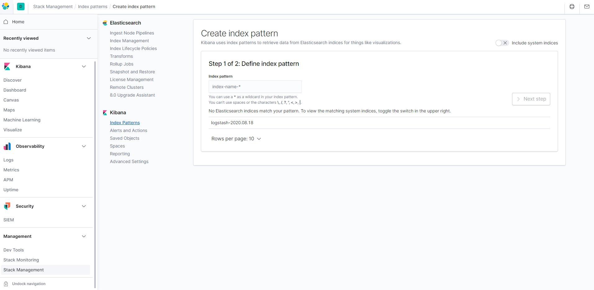
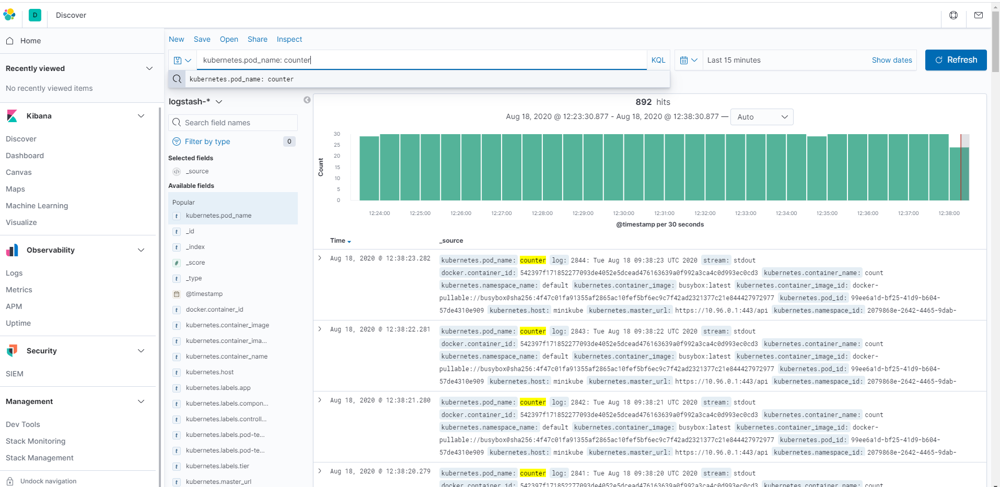

# Kubernetes içerisinde EFK stack ile log toplama
**İlk olarak namespace ve ElasticSearch kaynaklarını oluşturuyoruz.**

    kubectl create -f namespace.yaml
    kubectl create -f elasticsearch_statefulset.yaml

**Test etmek için aşağıdaki adımları izleyebilirsiniz.** 

    kubectl port-forward es-cluster-0 9200:9200 --namespace=kube-logging
    curl http://localhost:9200/_cluster/state?pretty
##### *curl aşağıdaki gibi bir sonuç vermesi gerekmektedir. StatusCode 200*

**En son olarak Kibana ve Fluentd yaml dosyalarını çalıştırıyoruz.**

    kubectl create -f kibana.yaml
    kubectl create -f fluentd.yaml
    
**Artık loglarımız Kibana'ya aktarılmaya başladı. Test etmek için bir counter pod'u oluşturup Kibana üzerinden gözlemleyebiliriz.**

    kubectl create -f counter.yaml

**Test etmek için aynı şekilde port-forward edip tarayıcımızdan Kibana'ya bağlanıyoruz.**

    kubectl port-forward kibana-5645d8d5b9-2dds4 5601:5601 --namespace=kube-logging
    http://localhost:5601

**Kibana'ya bağlandıktan sonra Index oluşturmamız "logstash-*" adlı gerekiyor.**
##### *Index oluştururken filter olarak @timestamp seçmeyi unutmayın*

##### *Daha sonra Discover kısmına gelip search kısmına pod name field'ını yazıp podumuzu yazıyıyoruz. Bu durumda "counter"* 
Ekran görüntüsünde görüldüğü 

    kubernetes.pod_name: counter

